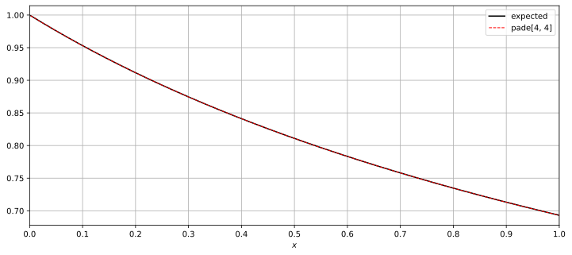
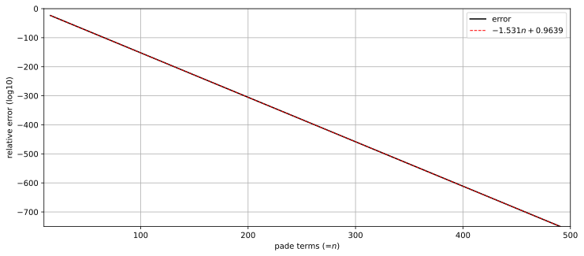
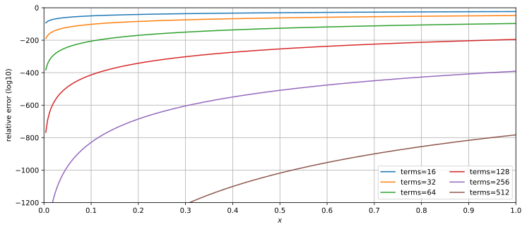

# LogPadeCoefGeneration

Padé approximation coefficients generation for log function.  

## Definition

The function to be approximated is  defined as follows:  

Namely,  

If both the numerator and denominator are 4 terms, then:  
  
  

## Precision
The number of terms in the Padé approximation and their relative accuracy as *x*=1 are as follows:  
Each additional 1 term to the numerator denominator, improves the decimal 1.531 digits, or 5.086 bits.  

The *x* and relative accuracy are as follows:  

## Coefficients
The computation time for the coefficients is O(*n*4).  
[results](results)

## See Also
[PadeApproximation](https://github.com/tk-yoshimura/PadeApproximation)